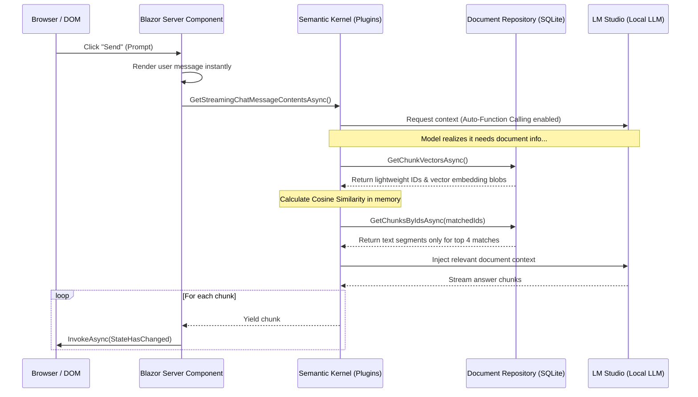

# InsightStream AI - Knowledge Retrieval Hub

InsightStream AI is an AI-native web application built with **Blazor Web App (.NET 10)** in **Interactive Server Mode** and **Microsoft Semantic Kernel**. It provides local semantic document indexing (RAG) and cognitive chat capabilities using local OpenAI-compatible APIs (like LM Studio) or OpenAI cloud services.

The codebase is structured using **Clean Architecture** principles across modular projects to maintain strict separation of core business domains, application services, infrastructure details, and presentation layouts.

---

## 🏗️ Tech Stack & Architecture

The solution is divided into four dedicated projects:

```
InsightStreamAI.slnx (Solution)
├── Domain/           ➔ Core enterprise data entities (framework-agnostic)
├── Application/      ➔ Repository interfaces, service definitions, models, and constants
├── Infrastructure/   ➔ SQLite EF Core Context, Repositories, SK native tools, and text splitters
└── Web/              ➔ Blazor presentation UI and startup injection routing (InsightStreamAI.csproj)
```

### Project Breakdowns
*   **Domain:** Houses pure entity objects like `Document`, `DocumentChunk`, `ChatConversation`, and `ChatMessage`.
*   **Application:** Outlines interfaces for data repositories and services (`IDocumentService`, `ISemanticKernelService`), settings models (`AISettings`), and common constants.
*   **Infrastructure:** Connects third-party adapters. Contains `AppDbContext`, concrete repositories, Semantic Kernel connectors, native plugins (`WebSearchPlugin`, `TimePlugin`), and text chunking logic.
*   **Web (Presentation):** Contains the Blazor razor components (`Home`, `Documents`, `Chat`), client pages, and handles app bootstrap (`Program.cs`).

---

## 🚀 Key Features

*   **Self-Contained RAG Pipeline:** Segmentizes documents and stores vector embeddings directly in a local **SQLite** database using basic floating-point cosine similarity (no external vector databases needed!).
*   **Auto-Function Calling (Agentic):** Registers C# helper plugins (Time, Web Search, Document Query) that the AI model autonomously decides to invoke to answer questions.
*   **Vibrant Glassmorphic Interface:** Sleek dark-mode dashboard, document hub, and streaming chat client with typing indicators and real-time SignalR rendering.

### System Flow


---

## 💻 Local Setup & Configuration

### 1. Configure Your Local AI Server (LM Studio)
1.  Download and install [LM Studio](https://lmstudio.ai/).
2.  Search and download a Chat Model: e.g., `Qwen2.5-7B-Instruct-GGUF` (select a `q4_k_m` or `q5_k_m` quantization).
3.  Search and download an Embedding Model: e.g., `mixedbread-ai/mxbai-embed-large-v1-GGUF`.
4.  Go to the **Local Server** tab (double-arrows) in LM Studio:
    *   Load the Qwen model at the top.
    *   Under **Text Embedding Model**, load `mxbai-embed-large-v1`.
    *   Click **Start Server** (hosts by default at `http://localhost:1234/v1`).

### 2. Configure Secrets and AI Parameters via AppHost
Since configuration is orchestrated by .NET Aspire, you do not need to configure `appsettings.json` directly in the Blazor project. Instead, store your local connection string and AI credentials in the **AppHost Project User Secrets**.

Open PowerShell/command prompt, navigate to the AppHost project directory (`src/InsightStreamAI.AppHost`), and execute:
```powershell
# Initialize user secrets in the AppHost
dotnet user-secrets init

# Set your local connection string and AI configurations
dotnet user-secrets set "ConnectionStrings:DefaultConnection" "Data Source=insightstream.db"
dotnet user-secrets set "AISettings:ApiKey" "sk-lm-NXDn8jQx:lqsApi2V5bC2mIabHcBR"
dotnet user-secrets set "AISettings:ChatModelId" "qwen/qwen3.5-9b"
dotnet user-secrets set "AISettings:EmbeddingModelId" "text-embedding-mxbai-embed-large-v1"
dotnet user-secrets set "AISettings:LocalEndpoint" "http://localhost:1234/v1"
```

*The AppHost reads these values at startup and securely maps them to environment variables for the Blazor portal. When running locally via SQLite, setting `"Data Source=insightstream.db"` is standard.*

### 3. Run the App using .NET Aspire
With .NET Aspire integrated, the project is run via the orchestrator project (`InsightStreamAI.AppHost`) which spins up the application and the Aspire Dashboard for full trace waterfalls.

Open PowerShell inside `D:\Workspace\Visual Studio\InsightStreamAI` and run:
```powershell
dotnet run --project src/InsightStreamAI.AppHost
```
This command starts:
1.  **The Blazor Web Portal** (`insightstream-ai`).
2.  **The .NET Aspire Dashboard** (link printed in output, e.g. `http://localhost:17123`).

In the dashboard, you can view real-time traces, metrics, console logs, and performance graphs for all Semantic Kernel and LLM actions.


---

## 🗄️ Database Schema

*   **`Documents`:** Stores uploaded file metadata (Title, Path, FileSize, CreatedAt).
*   **`DocumentChunks`:** Stores segment text, index sequence number, and the `Embedding` vector (converted to a C# `byte[]` blob for performant storage).
*   **`ChatConversations`:** Stores conversational chat logs.
*   **`ChatMessages`:** Stores conversation history (Role, Content, CreatedAt).
