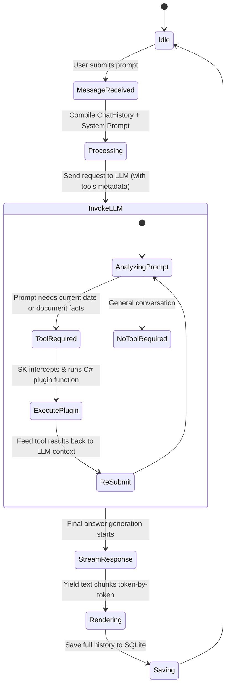

# AI Agent Architecture & Registry

This document lists the configuration, prompts, plugins, and execution behaviors of the AI agents within **InsightStream AI**.

---

## 1. System Agent Configuration

The core agent is powered by Microsoft Semantic Kernel. It operates as a chat assistant with access to local tools and memory.

### Agent Persona & System Prompt
The system instruction injected in `Infrastructure/Services/SemanticKernelService.cs` defines the boundaries, tone, and behavior of the agent:

```
You are InsightStream AI, a premium, intelligent knowledge assistant.
You help the user query, summarize, and analyze their uploaded documents.
Use the available search and time tools to find precise answers.
If you search and find no information in the documents, explain that you couldn't find it in the uploaded documents, but offer general knowledge if appropriate, or ask for clarification.
```

---

## 2. Agent Plugins (Cognitive Tools)

To extend the capabilities of the LLM beyond its static weights, we register three Semantic Kernel plugins. The model is allowed to auto-invoke these tools.

### 1. `DocumentQueryPlugin`
*   **Description:** Gives the agent access to the local indexed knowledge base using semantic search.
*   **Trigger Function:** `QueryDocumentsAsync(query)`
*   **Inputs:** `query` (string) - The contextual search keyword or statement.
*   **Mechanism:**
    1.  Generates a vector embedding for the query using the text embedding service.
    2.  Pulls lightweight chunk vector projections (excluding large text content) from SQLite via `IDocumentRepository.GetChunkVectorsAsync()`.
    3.  Calculates the **Cosine Similarity** of the vectors in memory.
    4.  Fetches full text records only for the top matched IDs via `IDocumentRepository.GetChunksByIdsAsync()`.
    5.  Returns the top 4 matched text chunks with a similarity score higher than 0.35.
    6.  Logs matching sources (including document title, match score, page numbers if available, and text excerpts) to the `ICitationTracker` service.

### 2. `WebSearchPlugin`
*   **Description:** Allows the agent to query DuckDuckGo for live internet context.
*   **Trigger Function:** `SearchAsync(query)`
*   **Inputs:** `query` (string) - The search query.
*   **Mechanism:** Requests DuckDuckGo's lite HTML search page, parses results using basic regex filters, and falls back to simulated search snippets if offline.

### 3. `TimePlugin`
*   **Description:** Provides the exact current date and time.
*   **Trigger Function:** `GetCurrentTime()`
*   **Inputs:** None.
*   **Mechanism:** Returns C# local datetime formatted as `DateTime.Now.ToString("F")`.

---

## 3. Execution Lifecycle & Auto-Function Calling

The orchestrator utilizes `ToolCallBehavior.AutoInvokeKernelFunctions` inside the streaming chat settings.



---

## 4. Citation Tracking & UI Feedback

To maintain high trustworthiness and transparency, the chat system traces exactly where the LLM gets its facts.
*   **`ICitationTracker`:** A scoped service (`CitationTracker`) that accumulates citations during a single request lifecycle.
*   **Database Schema:** Chat messages contain a `CitationsJson` column where the matching citations (excerpts, document titles, scores, and page numbers) are serialized and saved.
*   **Interactive UI:** In the front-end chat interface, citations are rendered as interactive badges showing the document name and match percentage. Clicking a badge displays the exact text excerpt retrieved from the document.

