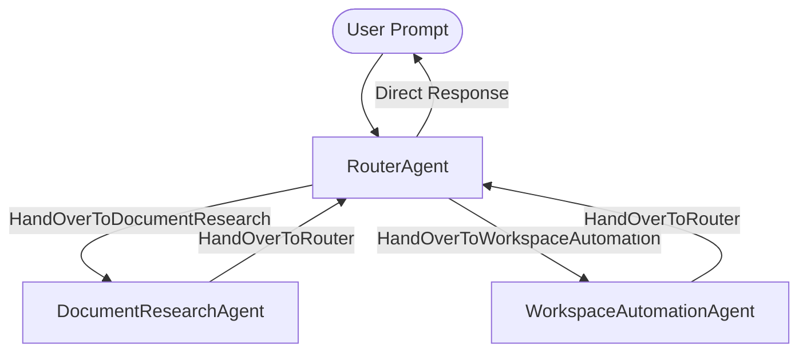
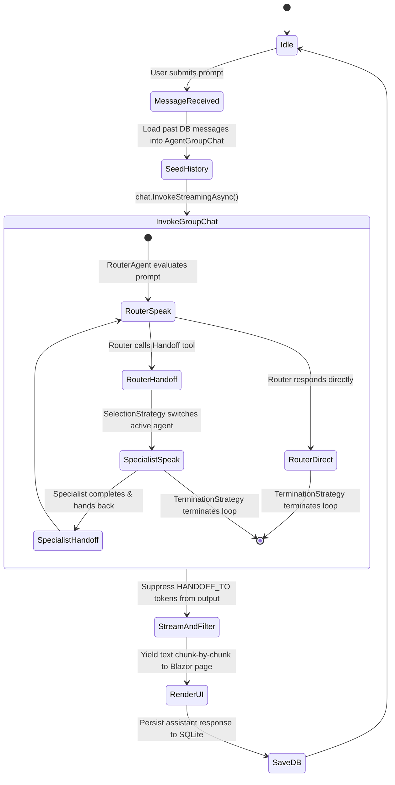

# AI Agent Architecture & Registry

This document defines the multi-agent topology, agent personas, plugins, handoff contracts, and execution lifecycle within **InsightStream AI**.

---

## 1. Multi-Agent Topology Overview

To replace the monolithic single-agent chatbot, InsightStream AI has been upgraded to a **Hierarchical Orchestrator-Subagent multi-agent system** utilizing the Semantic Kernel Agent Framework.

### Agent Roles & Configurations

Each agent runs on a dedicated Kernel instance cloned from the root container, ensuring strict scoping of capabilities (least-privilege tool execution):

| Agent Name | Description | Active Plugins | System Instruction Prompt |
|---|---|---|---|
| **`RouterAgent`** | Central orchestrator evaluating user intent to delegate tasks. | `HandoffPlugin` | Evaluates user input. Routes to `DocumentResearchAgent` for document queries, `WorkspaceAutomationAgent` for time/web queries, or responds directly for general conversation. |
| **`DocumentResearchAgent`** | Specialist in querying local document vector database embeddings. | `DocumentQueryPlugin`, `HandoffPlugin` | Calls `QueryDocumentsAsync` when asked about indexed knowledge/PDFs, summarizes the findings, and hands control back. |
| **`WorkspaceAutomationAgent`** | Specialist in searching the web and checking time. | `WebSearchPlugin`, `TimePlugin`, `HandoffPlugin` | Calls `SearchAsync` or `GetCurrentTime` to execute platform workflows and hands control back. |

---

## 2. Handoff Coordination Strategy

Rather than rigid hardcoded routing or manual prompt parsing, the agent topology relies on a dynamic, tool-driven handoff orchestration.

### The Handoff Plugin (`HandoffPlugin`)
Agents call explicit function tools to yield control to other nodes:
- `HandOverToDocumentResearch()`: Returns `"HANDOFF_TO: DocumentResearchAgent"`.
- `HandOverToWorkspaceAutomation()`: Returns `"HANDOFF_TO: WorkspaceAutomationAgent"`.
- `HandOverToRouter()`: Returns `"HANDOFF_TO: RouterAgent"`.

### Routing & Turn Management
Two custom strategies govern the `AgentGroupChat` turn lifecycle:

1. **`MultiAgentSelectionStrategy`**:
   - Inspects the last message content and tool execution outputs in the group history.
   - If a handoff token (e.g., `HANDOFF_TO: DocumentResearchAgent`) is detected, it selects that agent as the next speaker.
   - Otherwise, defaults to the `RouterAgent`.

2. **`MultiAgentTerminationStrategy`**:
   - Decides when the execution loop terminates.
   - If the `RouterAgent` decides to delegate to a specialist agent (calling a handoff function), the strategy does **not** terminate, allowing the specialist to speak.
   - Once a specialist completes its turn, or if the `RouterAgent` responds directly to the user (e.g., greetings), the strategy terminates execution so control is yielded back to the Blazor chat UI.

---

## 3. Core Agent Plugins

### 1. `DocumentQueryPlugin`
*   **Purpose:** Local semantic retrieval from uploaded documents.
*   **Trigger Function:** `QueryDocumentsAsync(query)`
*   **Mechanism:** Generates vector embeddings for query, performs in-memory cosine similarity against lightweight projections, fetches full matching text chunks from SQLite, and logs source citations.

### 2. `WebSearchPlugin`
*   **Purpose:** DuckDuckGo queries for live context.
*   **Trigger Function:** `SearchAsync(query)`
*   **Mechanism:** Scrapes DuckDuckGo Lite search page or yields simulated snippets if offline.

### 3. `TimePlugin`
*   **Purpose:** Real-time date and clock checks.
*   **Trigger Function:** `GetCurrentTime()`
*   **Mechanism:** Returns C# local datetime.

---

## 4. Execution Lifecycle

---

## 5. Citations Tracking
- Matching document excerpts, source document names, match percentages, and page numbers are captured via the `ICitationTracker` during search.
- Citations are saved to the `CitationsJson` database column and rendered as clickable source badges in the Blazor UI.

---

## 6. Human-in-the-Loop (HITL) Guardrail Pattern

To prevent autonomous or destructive tool execution (such as database updates, system tasks, or expensive automation routines) from executing blindly, **InsightStream AI** implements a strict, real-time Human-in-the-Loop approval circuit.

### Dynamic Execution Interception
1. **RequiresApproval Attribute**: Any plugin method decorated with the `[RequiresApproval]` attribute is automatically intercepted and queued for approval.
2. **Turn-Based Caching & Deduplication**: To avoid asking the user to approve the same tool multiple times during a single request turn, the system tracks approved signatures (Function Name + JSON-serialized arguments) in `AgentSessionContext.ApprovedSignatures`. If a matching signature has already been approved during the current active turn, it is auto-approved without prompting the user.

### End-to-End Coordination Lifecycle

```mermaid
sequenceDiagram
    autonumber
    actor User as User (End User)
    participant UI as Blazor Chat Component
    participant SKService as SemanticKernelService
    participant SK as Semantic Kernel Agent
    participant Filter as WorkflowApprovalFilter
    participant Mgr as WorkflowApprovalManager
    participant Hub as ApprovalHub

    User->>UI: Types Prompt & Presses Enter
    UI->>UI: Set isSending = true
    UI->>SKService: Call GetStreamingResponseAsync(prompt)
    activate SKService
    
    SKService->>Mgr: SetStatus(Running)
    SKService->>SK: chat.InvokeStreamingAsync()
    activate SK
    
    SK->>Filter: Invokes Function (e.g. SearchAsync)
    activate Filter
    
    Note over Filter: Check Turn Cache (ApprovedSignatures)<br/>If matches, auto-approve & skip prompt
    
    Filter->>Mgr: RequestApprovalAsync(conversationId, fn, args)
    activate Mgr
    Mgr->>Mgr: Set Status = PendingApproval
    Mgr->>Mgr: Create TaskCompletionSource<bool> (tcs)
    
    Mgr->>Hub: Broadcast ReceiveApprovalRequest(args)
    Hub->>UI: ReceiveApprovalRequest Event
    UI->>UI: Show IDE-Style Inline Approval Card
    Note over Filter, Mgr: Halted: await tcs.Task (non-blocking yield)
    
    rect rgb(30, 40, 50)
        Note over User, UI: Interaction Phase
        User->>UI: Clicks Approve or Deny
        UI->>Hub: Send RespondToApproval(approved)
        Hub->>Mgr: RespondToApproval(approved)
        Mgr->>Mgr: tcs.TrySetResult(approved)
    end

    Mgr-->>Filter: Returns approved (bool)
    deactivate Mgr

    alt Approved
        Filter->>SK: await next(context) (Execute Tool)
        SK-->>Filter: Tool Result
        Filter-->>SK: Continue Workflow
        SKService-->>UI: Yield streaming text chunks
        UI->>UI: Render text to chat
    else Denied
        Filter->>Filter: Throw ApprovalDeniedException
        deactivate Filter
        SKService->>SKService: Catch ApprovalDeniedException
        deactivate SK
        SKService-->>UI: Yield "Workflow Cancelled" error chunk
        SKService->>Mgr: SetStatus(Idle)
        deactivate SKService
        UI->>UI: Render cancellation warning
        UI->>UI: Set isSending = false
    end
```

The diagram below details the coordination flow between the background execution agent thread and the Blazor client using ASP.NET Core SignalR and the `TaskCompletionSource<T>` pattern.

### Components
- **`AgentSessionContext`**: Tracks the active conversation ID and stores approved signature IDs (`ApprovedSignatures`) for the current turn.
- **`WorkflowApprovalFilter`**: Intercepts SK function invocations, checking turn caches and pausing execution asynchronously if approval is required.
- **`WorkflowApprovalManager`**: Coordinates pending approval requests, stores `TaskCompletionSource<bool>` instances, and dispatches SignalR broadcasts.
- **`ApprovalHub`**: Real-time SignalR Hub linking frontend clicks back to the manager.
- **`Chat (Chat.razor)`**: Connects to the hub, renders the inline confirmation card right above the text input, and dispatches responses.

---

## 7. Local LLM Context Isolation (History Filtering)

When operating with local OpenAI-compatible models (like Qwen-9B or Llama-3), standard Semantic Kernel agent execution can result in context confusion. Local models can struggle with history that contains consecutive assistant responses or intermediate handoff coordination tokens (e.g. `HANDOFF_TO: ...`), leading to empty completions or infinite loops.

To address this, the system implements a custom decorator pattern:

### `HistoryFilteringChatCompletionService`
* **Mechanism**: This class wraps the default `IChatCompletionService` implementation in the DI container.
* **Context Isolation**: When a specialist agent (such as `DocumentResearchAgent` or `WorkspaceAutomationAgent`) executes a prompt, the decorator filters the conversation history to include only:
  1. The system prompt of the active agent.
  2. The initial user request.
  3. The specific messages / execution trace relevant to that specialist's workflow.
* **Result**: Eliminates noisy intermediate orchestration tokens, allowing the local LLM to focus strictly on its designated specialist task and return high-fidelity responses.

